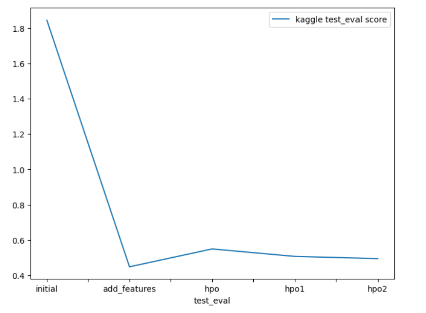

# Report: Predict Bike Sharing Demand with AutoGluon Solution
#### Aaditya Tyagi

## Initial Training
### What did you realize when you tried to submit your predictions? What changes were needed to the output of the predictor to submit your results?
**Five different experiments were performed as follows:**
1. Initial Raw Submission   **[Model: `initial`]**
2. Added Features Submission *(EDA +  Feature Engineering)* **[Model: `add_features`]**
3. Hyperparameter Optimization (HPO) - Initial Setting Submission 
4. Hyperparameter Optimization (HPO) - Setting 1 Submission 
5. Hyperparameter Optimization (HPO) - Setting 2 Submission **[Model: `hpo (top-hpo-model: hpo2)`]**

During my initial presentation of predicted results on Kaggle, a lot of changes needed to be made before the presentation. But as usual this was my first test in which the model was trained with default parameters as the baseline model to get only one score so I can use it to compare with the predicted score after doing feature engineering and hyperparameter tuning I can use Initially I only parse the datetime column of the dataset, which is not enough for better performance of the model. Here are some of the parameters and data columns I used in my initial prediction:

* Since 'count' is the target column I'm trying to estimate, this is the label I set.
* I ignore the 'random' and 'registered' columns as they are not present in the test dataset.
* I choose `root_mean_squared_error` as the metric to be used for evaluation.
* I have set a time limit of 10 minutes (600 seconds).
* And the preset I use to focus on building the best model is `best_quality`.

**Observation:** While submitting predictions obtained from all these five experiments, some of the experiments delivered negative predictions values. 
**Changes incorporated:** Kaggle refuses the submissions containing negative predictions values obtained from the predictor. Hence, all such negative outputs from respective predictors were replaced with 0. Since I used the data directly without doing feature engineering, the predictive score of the model was not that good and the score on Kaggle was also not that good. 

### What was the top ranked model that performed?
The top ranked model was the **WeightedEnsemble_L3** with a **validation RMSE score** of **36.051976** and the best **Kaggle score** of **0.45750 (on test dataset)**. The Reason to be the top ranked model was:

 This model was developed by training on data obtained using exploratory data analysis (EDA) and feature engineering without the use of a hyperparameter optimization routine. Upon hyperparameter-optimization, some models did show improved RMSE scores on validation data; however this model delivered the best performance on unseen test dataset. Note that many models delivered competitive performance, hence the selection was done considering both RMSE (cross-validation) and Kaggle (test data) scores respectively.

## Exploratory data analysis and feature creation
### What did the exploratory analysis find and how did you add additional features?
Exploratory analysis is the preliminary examination of data to discover patterns, relationships, and insights. It is often used to understand the structure of a dataset and identify possible relationships between variables.

* The data for `year`, `month`, `day`, *(dayofweek)* and `hour` were extracted as independent features separate from the `datetime` feature using data feature extraction. After feature extraction, the `datetime` feature was removed.

* Feature `datetime` was parsed as a datetime feature to retrieve the hour information from the timestamp

* The independent attributes `season` and `weather` were initially read as `integer`. Since these are categorical variables, they were converted to the `category` data type.

* Another categorical feature `day_type` was added based on `holiday` and `workingday` feature. It was defined to effectively segregate "weekday", "weekend" and "holiday" categories.

* The `casual` and `registered` features are only present in the train dataset and absent in the test data, therefore, these features were ignored during model training  and after removing there, it was observed that the RMSE scores improved significantly and these independent features were highly correlated with the target variable.

* Moreover, features `temp` (temperature in degree Celsius) and `atemp` (*'feels like'* temperature in degree Celsius) had a `high positive correlation of 0.98`. Hence, in order to reduce multicollinearity between independent variables, `atemp` was dropped from the train and test datasets respectively.

### How much better did your model preform after adding additional features and why do you think that is?
Analyzing the best model scores of the `initial prediction` and the `second prediction (after EDA)`, it is observed that there is an improvement of `74%`.

According to me this is possible because of the following changes made to the data.

* I have extracted the `year`, `month`, `day`, `day of week` and `hour` elements of the datetime feature as individual attributes. which leads to a significant improvement in the predicted values.

* The model performance improved after converting certain categorical variables with `integer` data types into their true `categorical` datatypes. 

* And last thing I am not considering features like `casual` and `registered` in `training set` because they are not present in `test data set`.

## Hyper parameter tuning
### How much better did your model preform after trying different hyper parameters?
Hyperparameter tuning was beneficial because it enhanced the model's performance compared to the initial submission. Three different configurations were used while performing hyperparameter optimization experiments. Although hyperparameter tuned models delivered competitive performances in comparison to the model with EDA and added features, the latter performed exceptionally better on the Kaggle (test) dataset. 

**Observations:**
* The prescribed settings were taken into account while using the autogluon package for training. However, the performances of hyperparameter optimized models were sub-optimal because the hyperparameters are tuned with a fixed set of values given by the user, which limit the options autogluon could explore. 

* Moreover, while performing hyperparameter optimization using autogluon, the 'time_limit' and 'presets' parameters are quite crucial. 

* Autogluon may fail to build any models for a prescribed set of hyperparameters to be tuned, if the time limit is too less for the models to be built. 

* Also, hyperparameter optimization with presets like "high_quality" (with auto_stack enabled) require high memory usage and are computationally intensive for the prescribed time limit using available resources. Hence, lighter and faster preset options like 'medium_quality' and 'optimized_for_deployment' were experimented with. I preferred faster and lighter preset, "optimize_for_deployment" for hyperparameter optimization routine, as the rest failed to create models using AutoGluon for the experimental configurations.

* `Exploration vs exploitation` is the biggest challenge while using AutoGluon with a prescribed range of hyperparameters.

### If you were given more time with this dataset, where do you think you would spend more time?
Given more time to work with this dataset, I would like to investigate additional potential outcomes when AutoGluon is run for an extended period with a high quality preset and enhanced hyperparameter tuning. In fact I already spend more time in forecasting with hyperparameter and I have seen a little more improvement compared to the other prediction.

### Create a table with the models you ran, the hyperparameters modified, and the kaggle score.
|model|hpo1|hpo2|hpo3|score|
|--|--|--|--|--|
|initial|prescribed_values|prescribed_values|"presets: 'high quality' (auto_stack=True)"|1.80023|
|add_features|prescribed_values|prescribed_values|"presets: 'high quality' (auto_stack=True)"|0.45750|
|hpo (top-hpo-model: hpo2)|Tree-Based Models: (GBM, XT, XGB & RF)|KNN|"presets: 'optimize_for_deployment"|0.49440|
### Create a line plot showing the top model score for the three (or more) training runs during the project.

### Create a line plot showing the top kaggle score for the three (or more) prediction submissions during the project.

## Summary

**AutoGluon Framework:** The project thoroughly studied and incorporated the AutoGluon AutoML framework for Tabular Data. AutoGluon is a powerful AutoML library that automates the process of training and evaluating machine learning models on tabular data, making it easier to build accurate predictive models.

**Automated Stack Ensemble and Regression Models:** AutoGluon's capabilities were fully utilized to create automated stack ensembles and individually configured regression models. Stack ensembling involves combining multiple models' predictions to improve overall performance, while individually configured regression models allow tailoring models for specific tasks.

**Quick Prototyping:** AutoGluon assisted in quickly prototyping a base-line model, allowing for faster development and testing of initial models.

**Improved Results with EDA and Feature Engineering:** The top-ranked AutoGluon-based model achieved significant improvement by leveraging data obtained after extensive exploratory data analysis (EDA) and feature engineering. This highlights the importance of human-driven insights and domain knowledge in enhancing model performance.

**Automatic Hyperparameter Tuning and Model Selection:** AutoGluon's capabilities in automatic hyperparameter tuning, model selection, and ensembling allowed the framework to explore and exploit the best possible options, improving the model's performance.

**Performance Comparison:** While hyperparameter tuning using AutoGluon led to improved performance over the initial raw submission, it didn't outperform the model with EDA, feature engineering, and no hyperparameter tuning. This indicates that the combination of human-driven insights and feature engineering had a greater impact on the model's performance than hyperparameter tuning alone.

**Challenges in Hyperparameter Tuning:** It was noticed that hyperparameter tuning using AutoGluon (without default hyperparameters or random configuration of parameters) can be a cumbersome process. The effectiveness of hyperparameter tuning is highly dependent on factors such as the time limit for tuning, prescribed presets, possible model families, and the range of hyperparameters to be tuned.

Overall, the AutoGluon AutoML framework proved to be a valuable tool in the bike sharing demand prediction project. It enabled quick prototyping, automatic stack ensembling, and hyperparameter tuning, leading to improved model performance. However, the most significant performance gains came from the integration of exploratory data analysis (EDA) and feature engineering, indicating the importance of human expertise and domain knowledge in building effective predictive models. Hyperparameter tuning, while beneficial, requires careful configuration and consideration of various factors to achieve optimal results.
