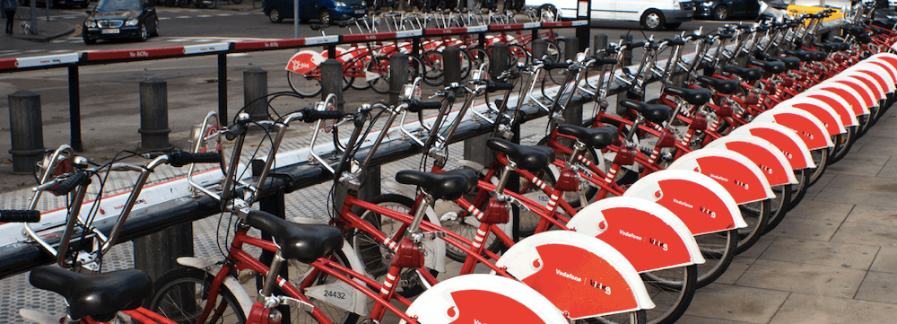

[](https://github.com/Addyty)
[](https://www.linkedin.com/in/aaditya-tyagi-99a1561ba/)

# Predict Bike Sharing Demand with AutoGluon

## Introduction to AWS Machine Learning Final Project
This project focuses on using AWS open-source AutoML library, AutoGluon to predict the bike sharing demand using the Kaggle Bike Sharing demand dataset. The ulimate objective is to use AutoGluon's 'Tabular Prediction' to achieve accurate AutoML-based baseline models without dealing with a lot of cumbersome issues like data cleaning, feature engineering, hyperparameter optimzation, model selection, etc.

### Source: AWS Machine Learning Engineer Nanodegree Scholarship Program

## Overview
This project was a part of the project assessment in the **'AWS x Udacity's Machine Learning Engineer Nanodegree Program'.**

## Problem Overview:

Bicycle sharing programs, also known as bike-sharing systems, offer a convenient and automated method for renting bicycles through a network of kiosk locations dispersed throughout urban areas. These systems enable individuals to rent a bike from one location and return it to another on an as-needed basis. At present, there are over 500 bike-sharing programs in operation worldwide.

The vast amount of data generated by these systems makes them an attractive subject for researchers as they provide explicit records of travel duration, departure and arrival location, and time elapsed. As such, bike-sharing systems serve as a sensor network, providing valuable insights into the mobility patterns of a city. This [Bike Sharing Demand Competition](https://www.kaggle.com/c/bike-sharing-demand) on Kaggle invites participants to utilize historical usage patterns and weather data to predict bike rental demand in the Washington D.C. based Capital Bikeshare program.

## Dataset:
<br>
[Bike-Sharing-Demand-Kaggle-Competition-Dataset-Link](https://www.kaggle.com/competitions/bike-sharing-demand/data)

## Approach:

1. The dataset was downloaded and analyzed with a focus on identifying its features and characteristics.
2. A model was trained using Autogluon's tabular predictions on the given dataset and the predictions were submitted to Kaggle for preliminary ranking. A baseline model was built with the default settings provided by AutoGluon's Tabular Prediction.
3. Conducted in-depth exploratory data analysis on existing features, with the goal of determining how changes to the dataset would affect model performance. Feature engineering was included to improve the performance of the model. This procedure was performed using the default automatic settings of AutoGluon's tabular prediction.
4. After initial data analysis and feature engineering, several modified iterations of the model were carried out to further improve the performance.
5. While performing the iterations mentioned in the last point, the Feature Engineer dataset was used to train the tabular prediction model of Autogluon, some hyperparameters were corrected to further improve the performance of the model.


## Getting Started (Resources)
* Clone this template repository `git clone git@github.com:udacity/nd009t-c1-intro-to-ml-project-starter.git` into AWS Sagemaker Studio (or local development).


* Visit the [Kaggle Bike Sharing Demand Competition](https://www.kaggle.com/c/bike-sharing-demand) page. There you will see the overall details about the competition including overview, data, code, discussion, leaderboard, and rules. You will primarily be focused on the data and ranking sections.

### Dependencies

```
Python 3.7
pydantic 1.10.3
MXNet 1.8
Pandas >= 1.2.4
AutoGluon 0.2.0 
```

### Installation
For this project, it is highly recommended to use Sagemaker Studio from the course provided AWS workspace. This will simplify much of the installation needed to get started.

For local development, you will need to setup a jupyter lab instance.
* Follow the [jupyter install](https://jupyter.org/install.html) link for best practices to install and start a jupyter lab instance.
* If you have a python virtual environment already installed you can just `pip` install it.
```
pip install jupyterlab
```
* There are also docker containers containing jupyter lab from [Jupyter Docker Stacks](https://jupyter-docker-stacks.readthedocs.io/en/latest/index.html).


## Information related to project specific files in this repository:<br><br>
**1. `Bike Sharing Demand Project.ipynb`:** Jupyter notebook with code<br><br>
**3. `Bike Sharing Demand Project.html`:** Jupitor notebook in Html Format<br><br>
**4. `Project_report.html`:** Report of the prediction in Html Format<br><br>


## Acknowledgements
Kaggle is hosting this competition for the machine learning community to use for fun and practice. This dataset was provided by Hadi Fanaee Tork using data from [Capital Bikeshare](https://capitalbikeshare.com/system-data). I would like to thanks Kaggle, Hadi Fanaee Tork et al. and the University of California, Irvine (UCI) machine learning repository for [hosting the dataset](http://archive.ics.uci.edu/ml/datasets/Bike+Sharing+Dataset). If you use the problem in publication, please cite:

*Fanaee-T, Hadi, and Gama, Joao, Event labeling combining ensemble detectors and background knowledge, Progress in Artificial Intelligence (2013): pp. 1-15, Springer Berlin Heidelberg.*


## License
[License](LICENSE.txt)<br><br>

Thank you for taking the time to visit this repository!

## Connect with me through:
<a href="https://www.linkedin.com/in/aaditya-tyagi-99a1561ba/"> 
   
</a>
<a href="https://instagram.com/addy.ty?igshid=ZDdkNTZiNTM=">
  
</a>
<a href="https://www.kaggle.com/aadityatyagi">
  
</a>
<br />

<p align="center">  </p>

